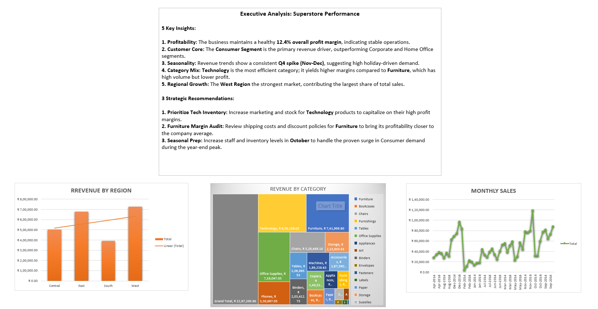

# Superstore-Sales-Analysis
Superstore Sales Analysis: From raw data to actionable executive insights using Microsoft Excel.

## 📊 Dashboard Preview

## 📁 Project Structure
- **data/**: Raw uncleaned Superstore dataset.
- **dashboard/**: Final Excel workbook containing Cleaned Data and Pivot Tables.
- **visuals/**: Individual chart exports for Regional, Category, and Trend analysis.

## 🔍 Key Insights
1. **Profitability:** Maintained a healthy **12.4% overall profit margin**.
2. **Customer Core:** The **Consumer Segment** is the primary revenue driver.
3. **Seasonality:** Consistent **Q4 spikes (Nov-Dec)** indicate holiday-driven demand.
4. **Efficiency:** **Technology** is the most profitable category.

## 🚀 Strategic Recommendations
* **Inventory Optimization:** Increase stock levels for Technology products.
* **Operational Audit:** Review shipping/discounts for Furniture to improve margins.
* **Seasonal Prep:** Scale up logistics in October to handle the year-end surge.

## 🛠️ Tools Used
* Microsoft Excel (Cleaning, Pivot Tables, Visualization)
* Markdown (Documentation)
